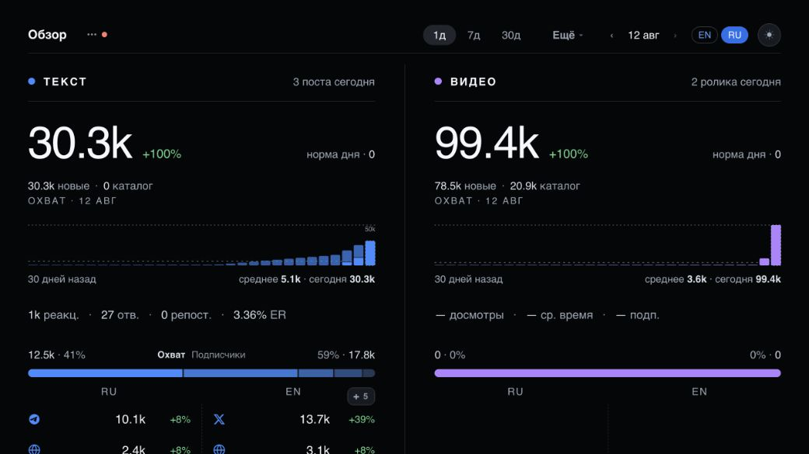
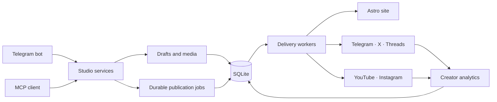

[English](README.md) · [Русский](README.ru.md)

# Solo Publisher

**Write in chat. Publish everywhere. Own the stack.**

Solo Publisher is an agent-native, self-hosted publishing studio for solo creators. Write from Telegram or an MCP client such as Codex, then publish to your website and social channels with durable scheduling, independent retries, media processing, and creator analytics.

[Live site](https://alexgetman.com) · [Install](#install) · [Production architecture](#how-it-works)


> This is not a starter kit or a mockup. Solo Publisher runs the complete publishing pipeline behind [alexgetman.com](https://alexgetman.com) in production.

## The workflow

```text
You: Publish this tomorrow at 09:00 in Russian and English.

Solo Publisher:
✓ Draft created and validated
✓ Media prepared
✓ Website, Telegram, X, and Threads scheduled
✓ Every destination will be delivered and retried independently
```

One conversation replaces the usual chain of CMS tabs, social schedulers, media tools, and spreadsheets. The website and every connected channel are destinations of the same durable publication rather than separate copies you have to keep in sync.

## Built for one creator

Solo Publisher deliberately serves one owner instead of reproducing agency software. There are no organizations, seats, approval committees, workspace hierarchies, or per-channel subscriptions.

- **Chat-native authoring** — create, edit, preview, schedule, and publish from a private Telegram bot.
- **Agent-native control** — the same Studio is exposed through MCP, so Codex and other compatible clients can write, publish, inspect analytics, and diagnose delivery.
- **Owned website** — an Astro publication site with bilingual pages, feeds, search, sitemap, structured metadata, Markdown endpoints, and an interactive story reader.
- **Durable delivery** — SQLite stores schedules, jobs, targets, retries, and external IDs. A failure on one platform does not invalidate the destinations that succeeded.
- **Text and short-form video** — publish text and media to Telegram, X, and Threads; run optional YouTube Shorts and Instagram Reels or Stories workflows.
- **Creator analytics** — collect publication metrics, audience snapshots, and operational state in one private Command Center.
- **Self-hosted by default** — your content, credentials, database, media, domain, and deployment stay under your control.



## Install

Requirements: Docker, and a domain whose DNS already points at the machine. The image is published for linux/amd64 and linux/arm64, so an ARM server needs no build.

```bash
git clone https://github.com/alexgetmancom/solo-publisher.git
cd solo-publisher
cp .env.example .env
```

Set `DOMAIN` in `.env`, then generate the two secrets it asks for:

```bash
openssl rand -hex 32
```

```bash
docker compose up -d
```

Caddy obtains and renews the TLS certificate itself, so there is no certbot and no renewal timer to set up. Within a minute:

- Public site: `https://your-domain/`
- Command Center: `https://your-domain/command-center`

Only Caddy publishes ports; the application is reachable through it alone. Nothing else in `.env` is required to start — a Studio with no credentials serves its site and its Command Center and publishes nowhere. Add a Telegram bot, then connect destinations from the Command Center or over MCP; `docker compose exec app bun /app/ops/cli.js doctor` lists what each one still needs.

`studio.yaml` holds deployment behavior that is not a publishing connection: whether this Studio serves a public site, its time zone, and video timing. Update with `docker compose pull && docker compose up -d`; diagnose with `docker compose logs -f app`.

Two things worth knowing on day one. The Studio sends you a copy of its database
every day, silently, in the same Telegram chat you author from; it covers posts,
schedules, delivery state and analytics, but **not** media files, which are far
larger than Telegram accepts and need a backup of the `app-data` volume. Turn it
off under Settings → Notifications → Database backup. And Telegram refuses file
downloads over 50 MB, which is smaller than a short video: to publish video, set
`TELEGRAM_API_ID`, `TELEGRAM_API_HASH` and `COMPOSE_PROFILES=telegram` in `.env`,
which starts a local Bot API server alongside the app and lifts the limit to 2 GB.

## Try it without installing

Requirements: [Bun 1.3.14](https://bun.sh/) and the native build prerequisites required by `sharp`.

```bash
bun install --frozen-lockfile
bun run demo
```

The demo creates deterministic fixture content, builds the production Astro bundle, and starts the complete Bun runtime without requiring Telegram or social-platform credentials.

- Public site: <http://localhost:8788/>
- Command Center: <http://localhost:8788/command-center?token=dev>

The fixture is deliberately not all-green: it includes enough history, delivery state, and analytics to make the operational views useful. Stop the server with `Ctrl+C`; run `bun run demo` again to rebuild the fixture from scratch.

## Running it from source

Copy the secret template:

```bash
cp apps/backend/secrets.env.example apps/backend/secrets.env
```

`studio.yaml` contains only deployment behavior that is not a publishing connection: whether this Studio serves the public site, its time zone, and video timing. Credentials stay in the ignored `apps/backend/secrets.env`; connected destinations live in the channel registry. Text posting, video posting and analytics always run. The second Studio is included as `studio.maru.yaml`.

The private Telegram bot and MCP endpoint operate the same Studio services. Posts created through either interface land in the same drafts, schedules, publication jobs, and analytics.

For an MCP client on another machine, the bundled [`studio` plugin](plugin/README.md) packages the remote transport and the operating skill. Its [setup prompt](plugin/setup-prompt.md) connects and verifies a deployment without exposing its database or SSH access.

## Supported destinations

| Destination | Text | Media | Short video | Analytics |
| --- | :---: | :---: | :---: | :---: |
| Website | ✓ | ✓ | — | ✓ |
| Telegram channel | ✓ | ✓ | — | ✓ |
| Telegram Stories | — | ✓ | ✓ | — |
| X | ✓ | ✓ | — | ✓ |
| Threads | ✓ | ✓ | — | ✓ |
| YouTube Shorts | — | — | ✓ | ✓ |
| Instagram Reels / Stories | — | ✓ | ✓ | ✓ |

Availability depends on the channels connected to the Studio and their credentials. Solo Publisher uses your own platform accounts and API credentials; it is not an aggregator sitting between you and your audience.

## How it works



The core is intentionally small: Telegram and MCP are command adapters over the same Studio services. Those services create durable SQLite publication jobs; workers deliver each target independently. The private Command Center and operations CLI read and maintain that same state.

Heavy media processing can run locally with ffmpeg or through the included remote HTTP worker. The remote worker performs hardware-accelerated transforms without taking over Telegram polling or the durable queues. See [`deploy/media-processor`](deploy/media-processor/README.md).

## Stack

- Bun and TypeScript
- Astro and Svelte
- grammY and MTProto
- SQLite and Drizzle ORM
- MCP over HTTP
- ffmpeg and sharp
- Docker Compose, Caddy, and immutable-image deployment

There is no Redis, RabbitMQ, separate database server, or multi-tenant application layer.

## Development

```bash
bun run typecheck
bun run lint
bun run test
bun run build
```

`bun run check:all` runs the full repository gate. Production deployment is intentionally specific to the live alexgetman.com installation; self-hosters should treat the committed deployment files as an implementation reference and supply their own domains, credentials, storage paths, and host configuration.

## Security

Runtime secrets, SQLite databases, Telegram sessions, generated media, logs, and production environment files are excluded from Git. Never commit a token, OAuth refresh token, session, or production data export.

The production container starts as root only to fix ownership on dedicated bind-mounted data directories, then irreversibly drops to an unprivileged user before loading the server. Do not point those mounts at shared host directories.

## License

Licensed under the [Apache License 2.0](LICENSE).
