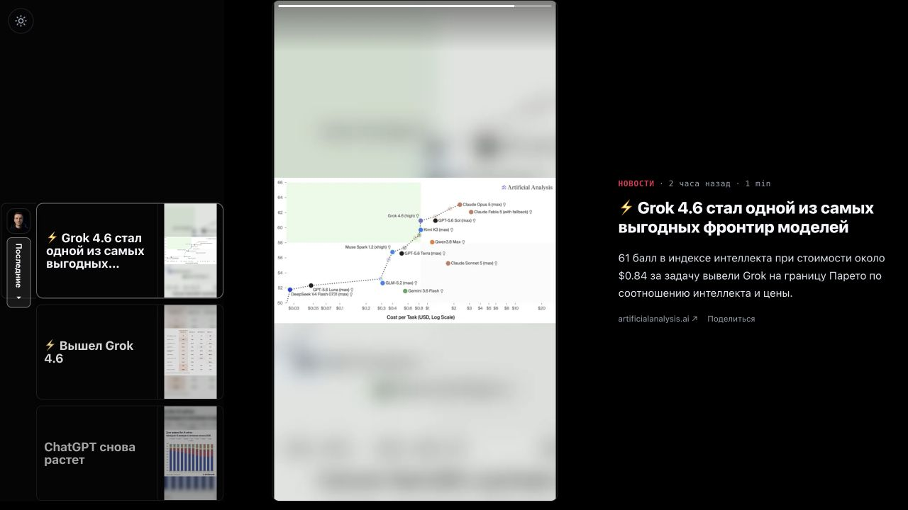
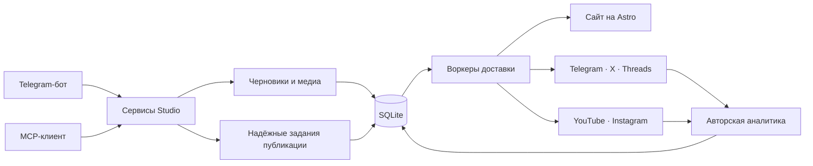

[English](README.md) · [Русский](README.ru.md)

# Solo Publisher

**Пишите в чате. Публикуйте везде. Владейте всей системой.**

Solo Publisher — это self-hosted редакция для независимых авторов, изначально рассчитанная на работу с ИИ-агентами. Пишите из Telegram или через MCP-клиент вроде Codex, а затем публикуйте материалы на своём сайте и в социальных сетях с надёжным расписанием, независимыми повторами доставки, обработкой медиа и авторской аналитикой.

[Рабочий сайт](https://alexgetman.com/ru/) · [Установка](#установка) · [Архитектура](#как-это-работает)



> Это не стартовый шаблон и не макет. Solo Publisher управляет всей production-системой публикации [alexgetman.com](https://alexgetman.com/ru/).

## Рабочий процесс

```text
Вы: Опубликуй это завтра в 09:00 на русском и английском.

Solo Publisher:
✓ Черновик создан и проверен
✓ Медиа подготовлены
✓ Сайт, Telegram, X и Threads поставлены в расписание
✓ Каждый канал будет доставлен и при необходимости повторён независимо
```

Один разговор заменяет привычную цепочку из CMS, планировщиков соцсетей, медиаинструментов и таблиц. Сайт и каждый подключённый канал становятся адресатами одной надёжной публикации, а не отдельными копиями, которые приходится синхронизировать вручную.

## Сделано для одного автора

Solo Publisher намеренно обслуживает одного владельца и не воспроизводит агентское корпоративное ПО. Здесь нет организаций, платных мест, комитетов согласования, иерархий рабочих пространств и подписки за каждый канал.

- **Создание материалов в чате** — создавайте, редактируйте, просматривайте, планируйте и публикуйте через приватного Telegram-бота.
- **Управление через ИИ-агента** — та же Studio доступна через MCP, поэтому Codex и другие совместимые клиенты могут писать, публиковать, читать аналитику и диагностировать доставку.
- **Собственный сайт** — сайт на Astro с двумя языками, лентами, поиском, sitemap, структурированными метаданными, Markdown-эндпоинтами и интерактивным просмотром историй.
- **Надёжная доставка** — SQLite хранит расписание, задания, цели, повторы и внешние идентификаторы. Сбой одной платформы не отменяет успешную доставку в остальные.
- **Текст и короткие видео** — публикуйте текст и медиа в Telegram, X и Threads; при необходимости подключайте YouTube Shorts, Instagram Reels и Stories.
- **Авторская аналитика** — собирайте метрики публикаций, снимки аудитории и состояние системы в приватном Command Center.
- **Self-hosted по умолчанию** — контент, ключи, база данных, медиа, домен и deployment остаются под вашим контролем.


## Установка

Понадобятся Docker и домен, DNS которого уже указывает на эту машину. Образ публикуется для linux/amd64 и linux/arm64, поэтому на ARM-сервере ничего собирать не нужно.

```bash
git clone https://github.com/alexgetmancom/solo-publisher.git
cd solo-publisher
cp .env.example .env
```

Укажите `DOMAIN` в `.env` и сгенерируйте два секрета, которые он просит:

```bash
openssl rand -hex 32
```

```bash
docker compose up -d
```

Caddy сам получает и продлевает TLS-сертификат, поэтому ни certbot, ни таймер продления настраивать не нужно. Через минуту Command Center доступен по адресу `https://ваш-домен/command-center`.

Публичный сайт по умолчанию выключен — большинству нужен конвейер публикации в уже существующие каналы, а не ещё один сайт, за которым надо следить. Выполните `ops studio-profile-set --site-enabled`, и по адресу `https://ваш-домен/` появится сайт с лентами, sitemap и Markdown-эндпоинтами. Изменение действует со следующего запроса.

Временные медиафайлы, которые внешняя площадка забирает во время публикации, складываются в `/data/media`. Контейнер сам создаёт этот каталог и исправляет владельца до сброса root-прав. Маршрут `/media/staging/` доступен даже при выключенном публичном сайте, поэтому для свежего self-host не нужны ручные `mkdir` и `chmod`.

Порты публикует только Caddy; приложение доступно исключительно через него. Больше ничего в `.env` для запуска не требуется — Studio без единого ключа обслуживает свой сайт и Command Center и никуда не публикует. Добавьте бота Telegram, затем подключайте назначения из Command Center или через MCP; `docker compose exec app bun /app/ops/cli.js doctor` покажет, чего каждому из них не хватает.

`ops studio-profile` показывает, от чьего имени публикует эта Studio, её часовой пояс, наличие публичного сайта и тайминги видео; `ops studio-profile-set` их меняет. Они лежат в базе, поэтому переживают передеплой и не требуют рестарта. Обновление образа — `docker compose pull && docker compose up -d`, диагностика — `docker compose logs -f app`.

Две вещи, которые стоит знать сразу. Studio ежедневно и беззвучно присылает копию
своей базы в тот же чат Telegram, из которого вы пишете: посты, расписание,
состояние доставки и аналитику. Медиафайлы в неё **не входят** — они намного
больше того, что принимает Telegram, и требуют бэкапа тома `app-data`. Отключить
можно в Настройках → Уведомления → Бэкап базы. И Telegram не отдаёт файлы больше
50 МБ, что меньше короткого видео: чтобы публиковать видео, укажите в `.env`
`TELEGRAM_API_ID`, `TELEGRAM_API_HASH` и `COMPOSE_PROFILES=telegram` — рядом с
приложением поднимется локальный Bot API и предел станет 2 ГБ.

## Подключение площадки

Две половины, разделённые намеренно: Studio должна знать, что площадка есть, и
держать ключи к ней.

```bash
docker compose exec app bun /app/ops/cli.js channel-connect --target threads_en
docker compose exec app bun /app/ops/cli.js doctor
```

`doctor` называет ровно те настройки, которых площадке недостаёт, и никогда не
печатает те, что уже есть. Те же два шага доступны из Telegram-бота и из
MCP-клиента.

**[Подключение площадки](docs/destinations.ru.md)** разбирает каждую платформу:
что нужно каждой, когда идти через провайдера вместо своего приложения Meta,
проводник для YouTube и то, что аукнется позже — токен Threads, протухающий через
60 дней, платная запись у X и предел в 50 МБ, из-за которого видео не работает
без локального Bot API.

**[Резервные копии](docs/backups.ru.md)** — что приходит само, а на что нужно
направить свой инструмент. **[Управление из агента](docs/mcp.ru.md)** — включение
MCP-транспорта и подключение к нему клиента.

## Попробовать без установки

Понадобятся [Bun 1.3.14](https://bun.sh/) и нативные зависимости, необходимые для сборки `sharp`.

```bash
bun install --frozen-lockfile
bun run demo
```

Демонстрационный режим создаёт предсказуемые тестовые материалы, собирает production-бандл Astro и запускает полный Bun runtime без ключей Telegram и социальных платформ.

- Публичный сайт: <http://localhost:8788/>
- Command Center: <http://localhost:8788/command-center?token=dev>

Тестовые данные намеренно не выглядят полностью исправными: в них достаточно истории, состояний доставки и аналитики, чтобы операционные экраны были полезны. Остановите сервер через `Ctrl+C`; повторный `bun run demo` пересоздаст fixture с нуля.

## Подключение собственной Studio

Скопируйте шаблон секретов:

```bash
cp apps/backend/secrets.env.example apps/backend/secrets.env
```

От чьего имени публикует Studio, обслуживает ли она публичный сайт, её часовой пояс и параметры видео лежат в её собственной базе и читаются/меняются через `ops studio-profile`. Ключи остаются в игнорируемом `apps/backend/secrets.env`, а площадки — в реестре каналов. Публикация текста, видео и сбор аналитики работают всегда.

Приватный Telegram-бот и MCP-эндпоинт работают с одними и теми же сервисами Studio. Посты, созданные через любой интерфейс, попадают в общие черновики, расписание, задания публикации и аналитику.

Для MCP-клиента на другом компьютере встроенный [плагин `studio`](plugin/README.md) объединяет удалённый транспорт и навык управления. Его [установочный prompt](plugin/setup-prompt.md) подключает и проверяет deployment без доступа к базе данных или SSH.

## Поддерживаемые площадки

| Площадка | Текст | Медиа | Короткие видео | Аналитика |
| --- | :---: | :---: | :---: | :---: |
| Сайт | ✓ | ✓ | — | ✓ |
| Telegram-канал | ✓ | ✓ | — | ✓ |
| Telegram Stories | — | ✓ | ✓ | — |
| X | ✓ | ✓ | — | ✓ |
| Threads | ✓ | ✓ | — | ✓ |
| YouTube Shorts | — | — | ✓ | ✓ |
| Instagram Reels / Stories | — | ✓ | ✓ | ✓ |

Доступность зависит от подключённых к Studio каналов и их ключей. Solo Publisher использует ваши собственные аккаунты и API credentials и не становится посредником между вами и аудиторией.

## Как это работает



Ядро намеренно небольшое: Telegram и MCP — два командных адаптера над одними сервисами Studio. Сервисы создают надёжные задания публикации в SQLite, а воркеры независимо доставляют каждую цель. Приватный Command Center и операционная CLI читают и обслуживают то же состояние.

Тяжёлую обработку медиа можно выполнять локально через ffmpeg или на включённом в репозиторий удалённом HTTP-воркере. Удалённый воркер выполняет аппаратно ускоренные преобразования, но не забирает себе Telegram polling или постоянные очереди. Подробнее в [`deploy/media-processor`](deploy/media-processor/README.md).

## Стек

- Bun и TypeScript
- Astro и Svelte
- grammY и MTProto
- SQLite и Drizzle ORM
- MCP поверх HTTP
- ffmpeg и sharp
- Docker Compose, Caddy и deployment неизменяемых образов

Здесь нет Redis, RabbitMQ, отдельного сервера базы данных или multi-tenant слоя приложения.

## Разработка

```bash
bun run typecheck
bun run lint
bun run test
bun run build
```

`bun run check:all` запускает полный набор проверок репозитория. Production deployment намеренно привязан к действующей установке alexgetman.com; при самостоятельном размещении используйте committed deployment-файлы как пример реализации и укажите собственные домены, credentials, пути хранения и настройки хоста.

## Безопасность

Runtime-секреты, базы SQLite, Telegram-сессии, сгенерированные медиа, логи и production-файлы окружения исключены из Git. Никогда не добавляйте в репозиторий токены, OAuth refresh tokens, сессии или выгрузки production-данных.

Production-контейнер запускается от root только для исправления владельца выделенных bind-mounted директорий, после чего необратимо понижает права до непривилегированного пользователя ещё до загрузки сервера. Не направляйте эти mounts в общие директории хоста.

## Лицензия

Проект распространяется по [Apache License 2.0](LICENSE).
