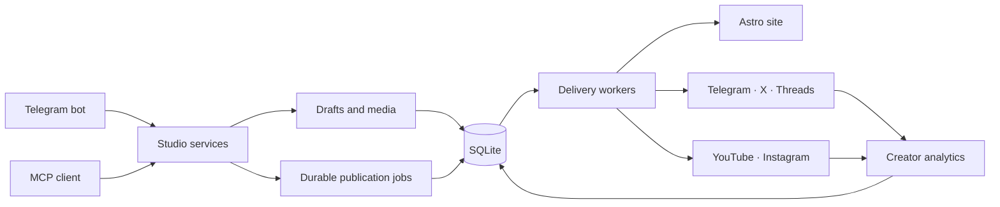

[English](architecture.md) · [Русский](architecture.ru.md)

# How it works



The core is intentionally small: Telegram and MCP are command adapters over the
same Studio services. Those services create durable SQLite publication jobs;
workers deliver each target independently. The private Command Center and
operations CLI read and maintain that same state.

The website and every connected channel are destinations of the same durable
publication rather than separate copies you have to keep in sync. A failure on
one platform does not invalidate the destinations that succeeded.

Heavy media processing can run locally with ffmpeg or through the included
remote HTTP worker. The remote worker performs hardware-accelerated transforms
without taking over Telegram polling or the durable queues. See
[`deploy/media-processor`](../deploy/media-processor/README.md).

## Built for one creator

Solo Publisher deliberately serves one owner instead of reproducing agency
software. There are no organizations, seats, approval committees, workspace
hierarchies, or per-channel subscriptions.

- **Chat-native authoring** — create, edit, preview, schedule, and publish from a private Telegram bot.
- **Agent-native control** — the same Studio is exposed through MCP, so Codex and other compatible clients can write, publish, inspect analytics, and diagnose delivery.
- **Owned website** — an Astro publication site with bilingual pages, feeds, search, sitemap, structured metadata, Markdown endpoints, and an interactive story reader.
- **Durable delivery** — SQLite stores schedules, jobs, targets, retries, and external IDs.
- **Text and short-form video** — publish text and media to Telegram, X, and Threads; run optional YouTube Shorts and Instagram Reels or Stories workflows.
- **Creator analytics** — collect publication metrics, audience snapshots, and operational state in one private Command Center.
- **Self-hosted by default** — your content, credentials, database, media, domain, and deployment stay under your control.

## Stack

- Bun and TypeScript
- Astro and Svelte
- grammY and MTProto
- SQLite and Drizzle ORM
- MCP over HTTP
- ffmpeg and sharp
- Docker Compose, Caddy, and immutable-image deployment

There is no Redis, RabbitMQ, separate database server, or multi-tenant
application layer.

## Development

```bash
bun run typecheck
bun run lint
bun run test
bun run build
```

`bun run check:all` runs the full repository gate. The committed deployment
files under `deploy/` are specific to the maintainer's own installation — its
domains, host paths and systemd units. Treat them as an implementation
reference and supply your own; `install.sh` is the supported path for a
self-host.

## Security

Runtime secrets, SQLite databases, Telegram sessions, generated media, logs, and
production environment files are excluded from Git. Never commit a token, OAuth
refresh token, session, or production data export.

The production container starts as root only to fix ownership on dedicated
bind-mounted data directories, then irreversibly drops to an unprivileged user
before loading the server. Do not point those mounts at shared host directories.
