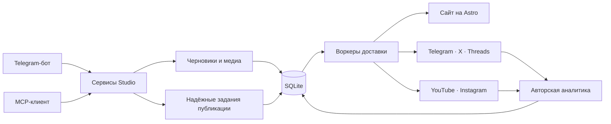

[English](architecture.md) · [Русский](architecture.ru.md)

# Как это работает



Ядро намеренно небольшое: Telegram и MCP — два командных адаптера над одними
сервисами Studio. Сервисы создают надёжные задания публикации в SQLite, а
воркеры независимо доставляют каждую цель. Приватный Command Center и
операционная CLI читают и обслуживают то же состояние.

Сайт и каждый подключённый канал — адресаты одной надёжной публикации, а не
отдельные копии, которые приходится синхронизировать вручную. Сбой одной
платформы не отменяет успешную доставку в остальные.

Тяжёлую обработку медиа можно выполнять локально через ffmpeg или на включённом
в репозиторий удалённом HTTP-воркере. Удалённый воркер выполняет аппаратно
ускоренные преобразования, но не забирает себе Telegram polling или постоянные
очереди. Подробнее в
[`deploy/media-processor`](../deploy/media-processor/README.md).

## Сделано для одного автора

Solo Publisher намеренно обслуживает одного владельца и не воспроизводит
агентское корпоративное ПО. Здесь нет организаций, платных мест, комитетов
согласования, иерархий рабочих пространств и подписки за каждый канал.

- **Создание материалов в чате** — создавайте, редактируйте, просматривайте, планируйте и публикуйте через приватного Telegram-бота.
- **Управление через ИИ-агента** — та же Studio доступна через MCP, поэтому Codex и другие совместимые клиенты могут писать, публиковать, читать аналитику и диагностировать доставку.
- **Собственный сайт** — сайт на Astro с двумя языками, лентами, поиском, sitemap, структурированными метаданными, Markdown-эндпоинтами и интерактивным просмотром историй.
- **Надёжная доставка** — SQLite хранит расписание, задания, цели, повторы и внешние идентификаторы.
- **Текст и короткие видео** — публикуйте текст и медиа в Telegram, X и Threads; при необходимости подключайте YouTube Shorts, Instagram Reels и Stories.
- **Авторская аналитика** — собирайте метрики публикаций, снимки аудитории и состояние системы в приватном Command Center.
- **Self-hosted по умолчанию** — контент, ключи, база данных, медиа, домен и deployment остаются под вашим контролем.

## Стек

- Bun и TypeScript
- Astro и Svelte
- grammY и MTProto
- SQLite и Drizzle ORM
- MCP поверх HTTP
- ffmpeg и sharp
- Docker Compose, Caddy и deployment неизменяемых образов

Здесь нет Redis, RabbitMQ, отдельного сервера базы данных или multi-tenant слоя
приложения.

## Разработка

```bash
bun run typecheck
bun run lint
bun run test
bun run build
```

`bun run check:all` запускает полный набор проверок репозитория. Файлы
deployment в `deploy/` привязаны к собственной установке автора — её доменам,
путям на хосте и systemd-юнитам. Используйте их как пример реализации и
укажите свои; поддерживаемый путь для self-host — `install.sh`.

## Безопасность

Runtime-секреты, базы SQLite, Telegram-сессии, сгенерированные медиа, логи и
production-файлы окружения исключены из Git. Никогда не добавляйте в репозиторий
токены, OAuth refresh tokens, сессии или выгрузки production-данных.

Production-контейнер запускается от root только для исправления владельца
выделенных bind-mounted директорий, после чего необратимо понижает права до
непривилегированного пользователя ещё до загрузки сервера. Не направляйте эти
mounts в общие директории хоста.
