# Полный анализ проекта alexgetman.com

> 23 файла проанализированы от самых крупных к самым маленьким. Drizzle snapshots (автогенерация) пропущены.

---

## 📊 Карта проекта по размеру и оценкам

| # | Файл | Строк | Область | Оценка |
|---|---|---|---|---|
| 1 | [home-news-player.ts](file:///Users/alex/projects/alexgetman.com/apps/web/src/scripts/home-news-player.ts) | 957 | Frontend — Story player | 7/10 |
| 2 | [dashboard.ts](file:///Users/alex/projects/alexgetman.com/apps/backend/src/services/dashboard.ts) | 896 | Backend — Admin dashboard | 6.5/10 |
| 3 | [bot.ts](file:///Users/alex/projects/alexgetman.com/apps/backend/src/bot.ts) | 886 | Backend — Telegram bot | 5/10 |
| 4 | [story-mobile.css](file:///Users/alex/projects/alexgetman.com/apps/web/src/styles/home-news/story-mobile.css) | 544 | Frontend — Mobile CSS | 5/10 |
| 5 | [schema.ts](file:///Users/alex/projects/alexgetman.com/apps/backend/src/db/schema.ts) | 440 | Backend — DB schema | 7/10 |
| 6 | [helpers.ts](file:///Users/alex/projects/alexgetman.com/apps/web/src/utils/helpers.ts) | 437 | Frontend — Utilities | 6/10 |
| 7 | [collectors.ts](file:///Users/alex/projects/alexgetman.com/apps/backend/src/metrics/collectors.ts) | 412 | Backend — Metrics | 7.5/10 |
| 8 | [generate-responsive-images.ts](file:///Users/alex/projects/alexgetman.com/scripts/generate-responsive-images.ts) | 365 | Build — Image pipeline | 5.5/10 |
| 9 | [cards-legacy.css](file:///Users/alex/projects/alexgetman.com/apps/web/src/styles/layout/cards-legacy.css) | 346 | Frontend — Post cards | 6/10 |
| 10 | [publish.ts](file:///Users/alex/projects/alexgetman.com/apps/backend/src/queue/publish.ts) | 345 | Backend — Publish queue | 7.5/10 |
| 11 | [drawer-dock.css](file:///Users/alex/projects/alexgetman.com/apps/web/src/styles/layout/drawer-dock.css) | 339 | Frontend — Nav/dock | 5/10 |
| 12 | [Layout.astro](file:///Users/alex/projects/alexgetman.com/apps/web/src/layouts/Layout.astro) | 327 | Frontend — Root layout | 7/10 |
| 13 | [pipeline.ts](file:///Users/alex/projects/alexgetman.com/apps/backend/src/services/pipeline.ts) | 301 | Backend — Pipeline status | 5.5/10 |
| 14 | [publishingSchedule.ts](file:///Users/alex/projects/alexgetman.com/apps/backend/src/publishingSchedule.ts) | 289 | Backend — Scheduling | 7/10 |
| 15 | [site/jobs.ts](file:///Users/alex/projects/alexgetman.com/apps/backend/src/site/jobs.ts) | 288 | Backend — Site build | 6.5/10 |
| 16 | [story-layout.css](file:///Users/alex/projects/alexgetman.com/apps/web/src/styles/home-news/story-layout.css) | 270 | Frontend — Story grid | 7/10 |
| 17 | [story-rail.css](file:///Users/alex/projects/alexgetman.com/apps/web/src/styles/home-news/story-rail.css) | 265 | Frontend — Story panel | 6.5/10 |
| 18 | [actions.ts](file:///Users/alex/projects/alexgetman.com/apps/backend/src/services/actions.ts) | 261 | Backend — Command actions | 6.5/10 |
| 19 | [story-context.css](file:///Users/alex/projects/alexgetman.com/apps/web/src/styles/home-news/story-context.css) | 256 | Frontend — Rail controls | 6.5/10 |
| 20 | [base.css](file:///Users/alex/projects/alexgetman.com/apps/web/src/styles/layout/base.css) | 250 | Frontend — Design tokens | 7.5/10 |
| 21 | [HomeNewsPage.astro](file:///Users/alex/projects/alexgetman.com/apps/web/src/components/HomeNewsPage.astro) | 162 | Frontend — Home component | 7/10 |
| 22 | [home-posts.ts](file:///Users/alex/projects/alexgetman.com/apps/web/src/utils/home-posts.ts) | 107 | Frontend — Post transforms | 7/10 |
| 23 | [site-interactions.ts](file:///Users/alex/projects/alexgetman.com/apps/web/src/scripts/site-interactions.ts) | 99 | Frontend — Client interactivity | 5.5/10 |

---

## Детальный анализ — Backend

---

### #1. [home-news-player.ts](file:///Users/alex/projects/alexgetman.com/apps/web/src/scripts/home-news-player.ts) — 957 строк — ⭐ 7/10

**Что делает:** Instagram Stories–подобный плеер на главной. Управляет ротацией постов, прогресс-барами, видео/аудио, свайпами, колёсиком, клавиатурой, feed mode фильтрацией, Giscus-комментариями, preload, analytics.

**✅ Сильные стороны:**
- Feature-complete: touch, keyboard, wheel, video fallback, audio mute memory, debug mode
- Defensive: `?.`, try-catch на play(), image → fallback chain
- Performance: `sendBeacon`, `loading="lazy"`, `decoding="async"`, preload ±2 соседних
- Zero deps, vanilla TS — мгновенный старт

**⚠️ Проблемы:**
- **God Object:** 957 строк в одном IIFE, ~25 функций, ~20 mutable переменных — нетестируемый
- **`render()` — 170 строк** (L569–L734) — обновляет DOM, сбрасывает таймеры, управляет видео, preload, analytics
- **Непоследовательные селекторы:** часть через `data-*`, часть через `.class` — CSS-привязка хрупкая
- **Magic numbers:** `8500ms`, `55px`, `140ms` без констант

---

### #2. [dashboard.ts](file:///Users/alex/projects/alexgetman.com/apps/backend/src/services/dashboard.ts) — 896 строк — ⭐ 6.5/10

**Что делает:** Server-rendered HTML для Command Center. SVG-чарты, метрики по 17+ платформам, вкладки Pipeline/Repair/Queue/Credentials/Diagnostics.

**✅ Сильные стороны:**
- Zero-dependency admin UI — правильный trade-off
- XSS-protected: `escapeHtml()` последовательно
- CSS-based metric toggling (`.show-mv/.show-ml`) — без JS

**⚠️ Проблемы:**
- **400+ строк HTML** в template literals без подсветки синтаксиса
- **200+ строк inline SVG-иконок** в PLATFORM_ICONS
- **Агрегация метрик дублируется 3 раза** (дневная/постовая/недельная)
- **Hardcoded MSK offset** `3 * 3_600_000` встречается ~8 раз без именованной константы

---

### #3. [bot.ts](file:///Users/alex/projects/alexgetman.com/apps/backend/src/bot.ts) — 886 строк — ⭐ 5/10

**Что делает:** Telegram bot controller — drafts, preview, editing, scheduling, publishing, album aggregation, entity→HTML конвертация.

**✅ Сильные стороны:**
- Транзакции для атомарности (cancelDraft, publishDraftToQueue)
- `entitiesToHtml` корректно обрабатывает UTF-16 offset model
- Defensive parsing (parseJson, parseTargets)

**⚠️ Проблемы:**
- **`publishDraftToQueue` — 200 строк** (L295–501) — God Function
- **`entitiesToHtml` — 9 уровней вложенных тернарников** (L854–873)
- **`handleDraftCallback` — длинная цепочка `if (action === "...")`** — классический кандидат для dispatch map
- **`backendDb.db.update(drafts).set({...}).where(eq(...)).run()`** повторяется ~15 раз
- **Нетестируемый:** DB, bot context и бизнес-логика переплетены

---

### #4. [schema.ts](file:///Users/alex/projects/alexgetman.com/apps/backend/src/db/schema.ts) — 440 строк — ⭐ 7/10

**Что делает:** Drizzle ORM схема для ~25 SQLite таблиц (publish jobs, posts, publications, drafts, metrics, media, capabilities, analytics).

**✅ Сильные стороны:**
- Чистые Drizzle идиомы, продуманная индексация
- Composite primary keys, lock-related columns

**⚠️ Проблемы:**
- **Нет foreign key constraints** — целостность только на уровне приложения
- **Status fields — plain `text()`** вместо enum/union types
- **Нет `$default`/`$onUpdate`** для `createdAt`/`updatedAt`
- **`posts` таблица имеет и `html`/`htmlEn`, и `postLocales`** — неясный source of truth

---

### #5. [collectors.ts](file:///Users/alex/projects/alexgetman.com/apps/backend/src/metrics/collectors.ts) — 412 строк — ⭐ 7.5/10

**Что делает:** Metric collectors для 12+ соцсетей. Каждый collector — standalone async функция с единым `MetricResult`.

**✅ Сильные стороны — лучший по структуре файл:**
- `fetchImpl` injection — каждый collector unit-testable
- Factory pattern (`createMetricCollectors`) — чистый и расширяемый
- Graceful degradation в Facebook collector

**⚠️ Проблемы:**
- Facebook collector (60 строк, 3 вложенных try/catch)
- X collector вручную конструирует OAuth — непоследовательно с остальными
- Telegram scraping (regex по HTML) — хрупко
- Нет timeout у большинства collectors (кроме Telegram)

---

### #6. [publish.ts](file:///Users/alex/projects/alexgetman.com/apps/backend/src/queue/publish.ts) — 345 строк — ⭐ 7.5/10

**Что делает:** Движок очереди публикаций — claiming, completing, failing, retrying с optimistic locking и exponential backoff.

**✅ Сильные стороны:**
- Rock-solid транзакционная консистентность
- Optimistic locking в `claimDuePublishJobs`
- Stale lock recovery, error classification, audit trail
- Partial publication для Threads carousel

**⚠️ Проблемы:**
- `completePublishJob` — 100 строк, слишком много обязанностей
- `parsePayload` молча возвращает `{}` при ошибке — маскирует баги
- Нет structured logging

---

### #7. [pipeline.ts](file:///Users/alex/projects/alexgetman.com/apps/backend/src/services/pipeline.ts) — 301 строка — ⭐ 5.5/10

**Что делает:** Сборщик данных для pipeline dashboard — job states, worker health, post counts, weekly listings.

**⚠️ Ключевые проблемы:**
- **N+1 query problem:** для каждого поста 2 дополнительных raw SQL запроса (100 постов = 200 лишних запросов)
- Raw SQL и Drizzle ORM в одном файле
- Untyped `Record<string, unknown>` повсюду
- Нет кеширования

---

### #8. [publishingSchedule.ts](file:///Users/alex/projects/alexgetman.com/apps/backend/src/publishingSchedule.ts) — 289 строк — ⭐ 7/10

**Что делает:** Управление расписанием публикаций — 5 слотов/день, auto-scheduling, rebalancing.

**✅ Сильные стороны:**
- Чистая доменная логика, корректная timezone обработка
- DI через `now` параметр — отлично для тестов

**⚠️ Проблемы:**
- `availableSlots` запускает DB query per day в цикле до 366 итераций
- `parseTargets` дублируется из `bot.ts`

---

### #9. [site/jobs.ts](file:///Users/alex/projects/alexgetman.com/apps/backend/src/site/jobs.ts) — 288 строк — ⭐ 6.5/10

**Что делает:** Site build processor — рендер feed JSON, материализация медиа, IndexNow ping.

**✅ Сильные стороны:**
- Атомарная запись файлов (temp → rename), чистый job lifecycle

**⚠️ Проблемы:**
- `Bun.write` привязывает к Bun runtime
- `sourceItems` — два разных code path с разной формой объекта
- `parseObject` — несогласованные null/empty conventions

---

### #10. [actions.ts](file:///Users/alex/projects/alexgetman.com/apps/backend/src/services/actions.ts) — 261 строка — ⭐ 6.5/10

**Что делает:** Обработчик операций Command Center — retry, edit, replace media.

**⚠️ Проблемы:**
- `parseMedia` не оборачивает `JSON.parse` в try/catch
- `parseObject`/`parseArray` — 4-я копия по кодбейзу

---

## Детальный анализ — Frontend

---

### #11. [story-mobile.css](file:///Users/alex/projects/alexgetman.com/apps/web/src/styles/home-news/story-mobile.css) — 544 строки — ⭐ 5/10

**Что делает:** Responsive overrides для story player (≤1120px, ≤760px, short desktop).

**✅ Сильные стороны:**
- `env(safe-area-inset-*)`, `100svh`, `clamp()`, `min()`

**⚠️ Проблемы:**
- **545 строк чистых overrides** — `height: auto; min-height: 0; max-height: none;` повторяется ~8 раз
- Hardcoded цвета (`#dc2626`, `#050505`) вместо CSS variables
- Нет `prefers-reduced-motion`
- Дублированные `writing-mode: horizontal-tb` (L208, L515)

---

### #12. [helpers.ts](file:///Users/alex/projects/alexgetman.com/apps/web/src/utils/helpers.ts) — 437 строк — ⭐ 6/10

**Что делает:** Shared утилиты — feed loading, text processing, date formatting, sanitization, responsive images.

**⚠️ Проблемы:**
- **`any` повсюду** — нет `FeedItem` интерфейса
- **God-file:** I/O + text + dates + URLs + HTML sanitization + image paths — 5–6 concerns
- Hardcoded `/home/deploy/ialexey-feed/data`
- Синхронный `fs.readFileSync`

---

### #13. [generate-responsive-images.ts](file:///Users/alex/projects/alexgetman.com/scripts/generate-responsive-images.ts) — 365 строк — ⭐ 5.5/10

**Что делает:** Build script — responsive WebP, OG images с SVG overlay, avatar variants.

**✅ Сильные стороны:**
- Smart mtime cache, content-hash для OG

**⚠️ Проблемы:**
- **Дублирует 5+ функций из helpers.ts** — `compactText`, `getFirstSentence`, `normalizePublicPath`, `postImagePath`, `categoryLabel` — все переимплементированы с мелкими различиями (e.g. `...` vs `…`).  Самый большой code smell в проекте.
- Нет типизации, sequential обработка без parallelism

---

### #14–18. CSS файлы (250–346 строк каждый)

| Файл | Оценка | Ключевое |
|---|---|---|
| [base.css](file:///Users/alex/projects/alexgetman.com/apps/web/src/styles/layout/base.css) | 7.5/10 | Хорошая дизайн-система, но `.header-nav` не адаптируется к light theme |
| [story-layout.css](file:///Users/alex/projects/alexgetman.com/apps/web/src/styles/home-news/story-layout.css) | 7/10 | Сильная grid-инженерия, но hardcoded цвета |
| [cards-legacy.css](file:///Users/alex/projects/alexgetman.com/apps/web/src/styles/layout/cards-legacy.css) | 6/10 | Tooltip через `::after` недоступен, `.badge--ai`/`--neural`/`--news` идентичны |
| [story-rail.css](file:///Users/alex/projects/alexgetman.com/apps/web/src/styles/home-news/story-rail.css) | 6.5/10 | Файл начинается с середины другого компонента (`.story-tab::after`) |
| [story-context.css](file:///Users/alex/projects/alexgetman.com/apps/web/src/styles/home-news/story-context.css) | 6.5/10 | Формула `calc((100% - 2.2rem) / 5)` повторяется 4 раза |
| [drawer-dock.css](file:///Users/alex/projects/alexgetman.com/apps/web/src/styles/layout/drawer-dock.css) | 5/10 | **Нарушение границ файла** — L1–23 это стили `.post-card--featured`. Drawer без focus trap |

---

### #19. [Layout.astro](file:///Users/alex/projects/alexgetman.com/apps/web/src/layouts/Layout.astro) — 327 строк — ⭐ 7/10

**✅:** Полное SEO покрытие (OG, Twitter, canonical, JSON-LD, hreflang). Theme script до paint — нет FOUC.

**⚠️:** WebMCP script 75 строк inline JS. Footer SVGs инлайнены 7 раз. Нет `<skip-to-content>`.

---

### #20. [HomeNewsPage.astro](file:///Users/alex/projects/alexgetman.com/apps/web/src/components/HomeNewsPage.astro) — 162 строки — ⭐ 7/10

**✅:** Чистая композиция компонентов, JSON payload для гидрации, `<noscript>` fallback.

**⚠️:** Dead props (`latestPosts`, `trendingPosts`, `topicStats`, `projects`). Giscus credentials hardcoded.

---

### #21–23. Малые файлы

| Файл | Строк | Оценка | Ключевое |
|---|---|---|---|
| [home-posts.ts](file:///Users/alex/projects/alexgetman.com/apps/web/src/utils/home-posts.ts) | 107 | 7/10 | Хороший transform pipeline, но `item: any` |
| [site-interactions.ts](file:///Users/alex/projects/alexgetman.com/apps/web/src/scripts/site-interactions.ts) | 99 | 5.5/10 | Нет ARIA state management, нет focus trap в drawer, language toggle теряет текущий путь |

---

## 🔎 Сквозные проблемы

### 🔴 Критические

| Проблема | Где |
|---|---|
| **`parseObject`/`parseArray`/`parseJson` — 4 копии** | bot.ts, pipeline.ts, site/jobs.ts, actions.ts |
| **`any` типизация вместо `FeedItem` интерфейса** | helpers.ts, home-posts.ts, generate-responsive-images.ts |
| **5 функций дублированы** между helpers.ts и generate-responsive-images.ts с мелкими различиями | `compactText`, `getFirstSentence`, `normalizePublicPath`, `postImagePath`, `categoryLabel` |
| **N+1 queries** в pipeline.ts | 2 raw SQL запроса на каждый пост в недельном view |

### 🟡 Значимые

| Проблема | Где |
|---|---|
| **Hardcoded цвета** (`#dc2626`, `#ef4444`, `#050505`) вместо CSS variables | 6 CSS файлов |
| **Нет accessibility:** focus trap, `:focus-visible`, skip-to-content, `prefers-reduced-motion` | drawer-dock, cards-legacy, story-rail, site-interactions, Layout.astro |
| **CSS файлы нарушают границы** — начинаются/заканчиваются в середине компонента | drawer-dock.css (L1–23 = card styles), story-rail.css (L1 = tab::after) |
| **Нет z-index scale** документации | 6+ файлов с произвольными z-index |
| **MSK timezone логика дублирована** | publishingSchedule.ts, pipeline.ts, dashboard.ts |
| **Нет structured logging** в backend | publish.ts, site/jobs.ts |

### 🟢 Минорные

| Проблема | Где |
|---|---|
| Debug panel в production CSS | story-rail.css |
| Dead props в HomeNewsPage | HomeNewsPage.astro |
| Hardcoded deployment paths | helpers.ts, generate-responsive-images.ts |
| `Bun.write` привязывает к runtime | site/jobs.ts |

---

## 📈 Итоговая таблица

### Backend — средний балл: 6.6/10

```
collectors.ts      ████████░░  7.5  — Лучший файл бэкенда
publish.ts         ████████░░  7.5
schema.ts          ███████░░░  7.0
publishingSchedule ███████░░░  7.0
dashboard.ts       ███████░░░  6.5
site/jobs.ts       ███████░░░  6.5
actions.ts         ███████░░░  6.5
pipeline.ts        ██████░░░░  5.5
bot.ts             █████░░░░░  5.0  — Самый проблемный файл
```

### Frontend — средний балл: 6.3/10

```
base.css           ████████░░  7.5  — Лучший файл фронтенда
Layout.astro       ███████░░░  7.0
HomeNewsPage.astro ███████░░░  7.0
home-news-player   ███████░░░  7.0
story-layout.css   ███████░░░  7.0
home-posts.ts      ███████░░░  7.0
story-rail.css     ███████░░░  6.5
story-context.css  ███████░░░  6.5
helpers.ts         ██████░░░░  6.0
cards-legacy.css   ██████░░░░  6.0
gen-responsive-img █████░░░░░  5.5
site-interactions  █████░░░░░  5.5
story-mobile.css   █████░░░░░  5.0
drawer-dock.css    █████░░░░░  5.0
```

### Общий балл проекта: **~6.4/10**

---

## 🎯 Топ-7 рекомендаций по приоритету

### 1. 🔴 Создать общий `FeedItem` интерфейс
Устранит `any` из 3 фронтенд-файлов. Определить один раз, использовать везде.

### 2. 🔴 Извлечь общие утилиты в shared модуль
`parseObject`/`parseArray`/`parseJson` — 4 копии в бэкенде.
`compactText`/`getFirstSentence`/etc. — 2 копии во фронтенде.

### 3. 🔴 Исправить N+1 queries в pipeline.ts
Заменить 2 запроса в `.map()` одним JOIN или batch query. С 100 постами это 200 лишних SQL-запросов на каждый HTTP-запрос к dashboard.

### 4. 🟡 Декомпозировать bot.ts
Разбить `publishDraftToQueue` (200 строк) и `handleDraftCallback` (116 строк). Заменить if-chain на dispatch map. Это самый проблемный файл проекта.

### 5. 🟡 CSS: заменить hardcoded цвета на CSS variables
`#dc2626` → `var(--accent)`, `#050505` → `var(--bg-deep)` и т.д. Затрагивает 6 CSS файлов, но даёт единую тему.

### 6. 🟡 Accessibility: focus trap + :focus-visible + skip-to-content
Drawer без focus trap, нет `:focus-visible` на кнопках, нет skip-to-content в Layout. Три самых impactful a11y исправления.

### 7. 🟢 Исправить границы CSS файлов
`drawer-dock.css` L1–23 → в `cards-legacy.css`. `story-rail.css` L1 → в `story-layout.css`. Простой copy-paste, но устранит путаницу.

---

## 💡 Что впечатлило

| Решение | Файл |
|---|---|
| `fetchImpl` injection во всех collectors — DI для тестируемости | collectors.ts |
| Optimistic locking + stale lock recovery в очереди | publish.ts |
| Zero-dep Story Player с полным input покрытием (touch, keyboard, wheel) | home-news-player.ts |
| SVG-чарт и CSS-based metric toggle в dashboard — без Chart.js | dashboard.ts |
| Mtime + content-hash cache для responsive images | generate-responsive-images.ts |
| JSON payload гидрация вместо client-side Astro JS | HomeNewsPage.astro |
| `enforce-typescript.ts` — language gate запрещающий .py/.js/.sh | CI pipeline |
| `atomicWriteJson` — temp → rename для crash-safe файлов | site/jobs.ts |

---

## 🛠️ Ревью CI/CD и деплоя

### 1. Схема гибридного пайплайна (Mermaid)

```mermaid
graph TD
    A[Push / Local Build CMD] --> B{Окружение?}
    
    %% Локальный Mac путь %%
    B -- Локальный Mac (Default) --> C[Docker Build Kit]
    C --> D[Стадия: build-in-docker]
    D --> D1[Установка devDependencies]
    D1 --> D2[astro build & server bundle]
    D2 --> H[Стадия: app]
    
    %% GitHub Actions путь %%
    B -- CI/CD (on-host) --> E[Хост раннера GitHub]
    E --> F[ bun run check:web & bundle]
    F --> G[Docker Buildx with on-host arg]
    G --> G1[Стадия: build-on-host]
    G1 --> G2[Простое копирование dist/ с хоста]
    G2 --> H
    
    %% Общие стадии %%
    I[mwader/static-ffmpeg] --> J[Стадия: ffmpeg-bin]
    J --> K[Сжатие UPX -1 за 11 секунд]
    K --> H
    
    L[Стадия: prod-deps] --> L1[bun install --production]
    L1 --> H
    
    H --> M[Финальный образ: Alpine + tini + bun --smol]
    M --> N[Push в GHCR / Local Image]
```



---

### 2. Оценка по областям

#### 1. Локальные хуки (lefthook) — ✅ Отлично (9/10)
* **pre-commit: biome autofix:** ✅ Правильно — фиксирует и стейджит.
* **pre-push: полный check:all:** ✅ Не даёт запушить сломанный код.
* **Скрипт check:all:** ✅ Последовательные проверки, fail-fast.
* **Рекомендация (TIP):** `check:all` запускает проверки последовательно. Это хорошо для fail-fast поведения, но параллельный запуск независимых шагов (`lint + knip + typecheck`) ускорил бы pre-push на ~30–40% (задача добавлена в планы).

#### 2. CI Pipeline (GitHub Actions) & Docker Build — ✅ Впечатляет (9.5/10)
* **Триггеры & Кэширование:** ✅ Версия bun зафиксирована + кэш `setup-bun` с `cache: true` отрабатывают идеально.
* **Language gate (enforce-typescript):** 🔥 Уникальная идея — жестко запрещает .py/.js/.sh в репо.
* **Multi-stage build с BUILD_SOURCE toggle:** 🔥 Элегантно — `in-docker` для Mac, `on-host` для CI. Решает проблему разделения сборки.
* **Изолированная стадия ffmpeg + upx:** ✅ Кэшируется отдельно. При быстром сжатии `-1` UPX отрабатывает за 11–18 секунд.
* **Prod-deps stage:** ✅ Минимальный образ на Alpine (`~200 MB` в распакованном виде).
* **Рекомендация:** Убрать хрупкий хардкод `rm -rf` в `prod-deps` в пользу `bun workspaces --production` (задача добавлена в планы).

#### 3. Docker Compose (prod) — ✅ Хорошо (8/10)
* **Healthcheck на /readyz:** ✅ Отличная практика.
* **Resource limits:** ✅ mem_limit, cpus, pids_limit — продакшен-ready.
* **Telegram Bot API как sidecar:** ✅ Изолированно.
* **Рекомендация:** Настроить автоматический CD деплой образа из GitHub Actions по SSH при пуше в main (задача добавлена в планы).

#### 4. Web Deployment (web-sync.ts) — ⚠️ Работает, но рискованно (5/10)
* **Проблема:** Сейчас скрипт запускается на сервере по крону «вслепую». Если тесты на гитхабе упали, но код запушен в `main`, сервер всё равно сделает pull и выкатит сломанную версию на прод.
* **Рекомендация (ВЫСШИЙ ПРИОРИТЕТ):**
  * Либо добавить в `web-sync.ts` проверку статуса CI-пайплайна через GitHub API перед git pull.
  * Либо полностью перенести деплой на push-модель из GitHub Actions после успешного выполнения тестов.

---

### 3. Сводная таблица оценок

| Область | Оценка | Баллы |
| :--- | :--- | :--- |
| **Локальные хуки** | Отлично | 9/10 |
| **CI Pipeline & Docker** | Впечатляет | 9.5/10 |
| **Docker Compose** | Хорошо | 8/10 |
| **Web Deployment (Sync)**| Работает, но рискованно | 5/10 |
| **Nginx** | Грамотно | 8.5/10 |
| **Общий CI/CD** | **Отлично (после оптимизаций)** | **~8.5/10** |
